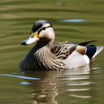
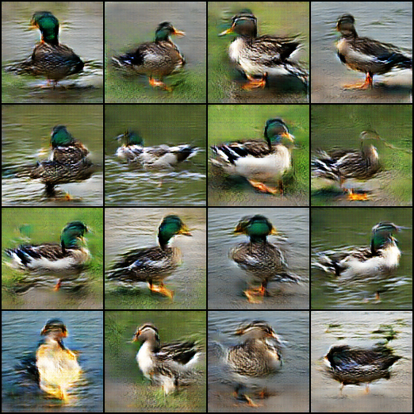

# DCGAN Duck


**Auteur:** Cédric Ludwigs

## À propos

Un projet d'entraînement et de génération d'images de canards utilisant DCGAN (Deep Convolutional Generative Adversarial Networks). Le réseau apprend à générer des images réalistes de canards à partir de bruit aléatoire.

## Fonctionnalités

- **Préparation des données** : Redimensionnement et augmentation du dataset de canards
- **Entraînement DCGAN** : Réseau génératif et discriminatif entièrement convolutional
- **Inférence** : Génération d'images de canards à partir de vecteurs de bruit
- **Modèles pré-entraînés** : Plusieurs checkpoints disponibles avec différentes configurations

## Structure du projet

```
├── 0_prepare_dataset.py      # Préparation des données
├── 1_DCGAN_duck.py           # Entraînement du modèle
├── 2_inference.py            # Génération d'images
├── data/                      # Datasets
│   ├── duck_original/
│   └── duck_resized/
└─── models/                    # Modèles pré-entraînés
```

## Installation

```bash
pip install -r requirements.txt
```

## Utilisation

### 1. Préparer les données

```bash
python 0_prepare_dataset.py
```

### 2. Entraîner le modèle

```bash
python 1_DCGAN_duck.py
```

### 3. Générer des images

```bash
python 2_inference.py
```

## Modèles disponibles

Un seul modèle est disponible pour l'instant entrainé dans le dossier `models/`. Vous pouvez le charger pour générer des images de canards.

## Configuration

Vous pouvez ajuster les paramètres d'entraînement directement dans `1_DCGAN_duck.py` :

- Taille des images : 64 ou 128 pixels
- Nombre d'epochs
- Taille du batch
- Taux d'apprentissage

## Dépendances

- PyTorch
- torchvision
- Pillow
- NumPy

Voir `requirements.txt` pour la liste complète.

## Résultats

Le modèle génère des images synthétiques de canards après entraînement. Les résultats s'améliorent graduellement avec le nombre d'epochs et la taille du dataset.

### Comparaison : Image originale vs Générée (50 epochs)

| Image Originale | Image Générée (50 epochs) |
|---|---|
|  |  |

Cette comparaison montre la capacité du modèle à reproduire les caractéristiques visuelles des canards après un entraînement de 50 epochs.

## Notes

- Les datasets originaux se trouvent dans `data/duck_original/`
- Les images sont redimensionnées à 64x64 ou 128x128 avant entraînement
- L'augmentation des données (flip horizontal) améliore les résultats
- Ici on atteint les limites de la génération d'images réalistes avec un DCGAN simple. Pour des résultats plus avancés, envisagez d'utiliser des architectures plus complexes ou des GANs conditionnels ou StyleGAN.
---

**Cédric Ludwigs** © 2026
